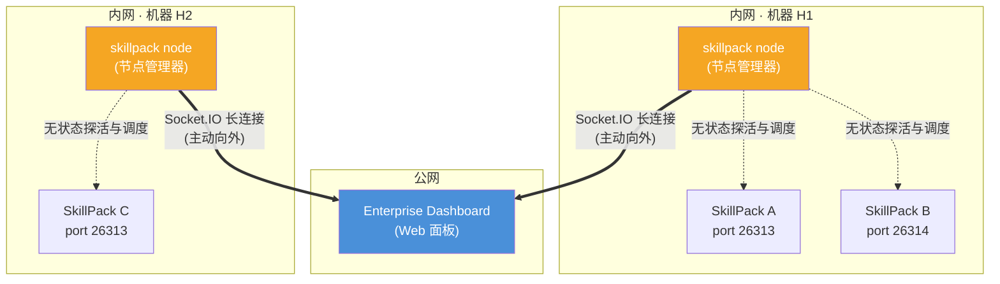
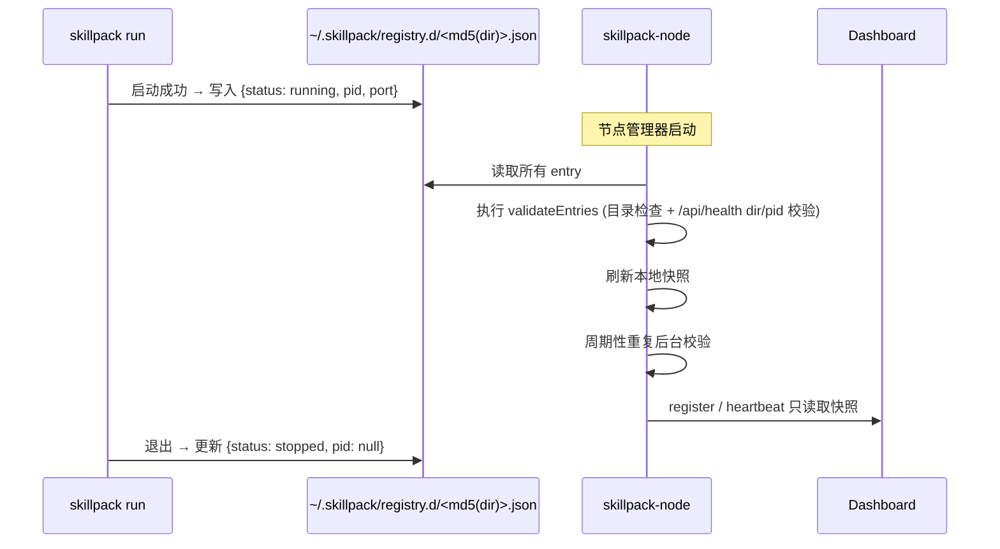

# SkillPack 企业监控面板 — 完整设计方案

## 一、产品概述

### 目标

为企业用户提供一个 Web 面板，集中监控分布在不同机器上的多个 SkillPack 实例，并支持远程管理（启动/停止/重启/部署）。

### 商业模式

| 层级           | 产品                           | 价格     |
| -------------- | ------------------------------ | -------- |
| **Free**       | 单个 SkillPack（开源）         | 免费     |
| **Team**       | Enterprise Dashboard (≤10节点) | $29/月   |
| **Business**   | Enterprise Dashboard (≤50节点) | $99/月   |
| **Enterprise** | 私有化部署 + SLA               | 按需定价 |

### 关键约束

- 企业功能**不能**破坏 SkillPack 开源版的独立运行能力
- 节点管理器拆分为独立包 `@cremini/skillpack-node`，`@cremini/skillpack` 保持纯粹的开源 CLI + Runtime

### 包拆分策略

| 包名                      | 协议     | 职责                                              |
| ------------------------- | -------- | ------------------------------------------------- |
| `@cremini/skillpack`      | MIT      | 开源 CLI：`create` / `run` / `zip` + Agent 运行时 |
| `@cremini/skillpack-node` | 商业协议 | 节点管理器：进程管理 + Dashboard 通信             |

> [!IMPORTANT]
> `@cremini/skillpack-node` 依赖 `@cremini/skillpack`，复用 registry 读写等基础能力。而 `@cremini/skillpack` 完全不知道 `skillpack-node` 的存在——registry 签到/签离是 Pack 自身行为，不涉及企业功能。

---

## 二、整体架构

### 三层模型



三层职责：

| 层     | 组件                           | 所属包                    | 职责                                                          |
| ------ | ------------------------------ | ------------------------- | ------------------------------------------------------------- |
| **L1** | SkillPack 实例                 | `@cremini/skillpack`      | AI Agent 业务运行，处理用户消息                               |
| **L2** | `skillpack-node`（节点管理器） | `@cremini/skillpack-node` | 管理本机所有 Pack 实例的生命周期，维护与 Dashboard 的 Socket.IO 连接 |
| **L3** | Enterprise Dashboard           | 独立服务                  | 集中监控、远程管理、权限控制                                  |

### 网络拓扑

```
Dashboard（公网）                          SkillPack 节点（内网）

  https://api.skillpack.sh        ◀════════  skillpack node 主动连接

  ❌ Dashboard 无法主动连接内网节点
  ✅ 所有通信由内网 → 公网发起
  ✅ 通过 Socket.IO 长连接实现双向通信
```

> [!IMPORTANT]
> Dashboard 在公网，SkillPack 节点在内网。**所有连接必须由节点管理器主动发起**。通过 Socket.IO 长连接实现双向通信——上行推送状态/指标，下行接收控制指令。

---

## 三、自动发现机制

### 核心思路

每个 `skillpack run` 启动/退出时，自动维护自己对应的注册文件。节点管理器读取注册目录即可发现所有 Pack，并通过后台校验线程持续修正状态。

### 注册表位置

```
~/.skillpack/registry.d/
```

### 数据结构

每个 Pack 对应一个单独 JSON 文件，文件名为 `md5(canonicalDir).json`，例如：

```text
~/.skillpack/registry.d/
├── 9a3d...c2.json   # /Users/me/packs/comic-explainer
└── a1b4...9f.json   # /Users/me/packs/code-reviewer
```

单文件内容：

```json
{
  "dir": "/Users/me/packs/comic-explainer",
  "name": "Comic Explainer",
  "version": "1.0.0",
  "port": 26313,
  "pid": 12345,
  "status": "running",
  "startedAt": "2026-03-25T10:00:00Z",
  "updatedAt": "2026-03-25T10:00:00Z"
}
```

### Pack 唯一标识策略

Dashboard 使用 **`nodeToken + dir`** 的复合键作为 Pack 实例的全局唯一标识，不在 `skillpack.json` 中引入额外的 `id` 字段。

| 特性         | 说明                                                           |
| ------------ | -------------------------------------------------------------- |
| **唯一性**   | 同一台机器上不可能有两个相同 `dir`，不同机器有不同 `nodeToken` |
| **零侵入**   | 不需要修改 `skillpack.json` 格式，不影响开源版                 |
| **分发安全** | 复制/zip 分发不会产生 ID 冲突                                  |
| **迁移语义** | 换目录 = Dashboard 视为新实例（合理行为）                      |

Dashboard 侧数据模型：

```
唯一标识 = nodeToken + dir

┌─────────────────────────────────────────┐
│ Node: ntk_abc123 (办公室-Mac-1)         │
│ ├── /Users/me/packs/comic-explainer     │  ← 实例 1
│ └── /Users/me/packs/code-reviewer       │  ← 实例 2
│                                         │
│ Node: ntk_xyz789 (服务器-Linux-1)       │
│ ├── /home/deploy/packs/comic-explainer  │  ← 实例 3（同名但不同实例）
│ └── /home/deploy/packs/translator       │  ← 实例 4
└─────────────────────────────────────────┘
```

### 签到/签离时机

| 时机                     | 操作                                         | 触发位置                                                                                                      |
| ------------------------ | -------------------------------------------- | ------------------------------------------------------------------------------------------------------------- |
| `skillpack run` 启动成功 | 覆盖自己的 entry 文件为 `status: "running"`，写入 `pid`、`port`、`updatedAt` | [server.ts](file:///Users/yava/myspace/finpeak/skillpack/skill-pack/src/runtime/server.ts) → `server.once("listening")` |
| `skillpack run` 正常退出 | 若当前 entry 的 `pid` 仍等于当前进程，则更新为 `status: "stopped"`、`pid: null` | [server.ts](file:///Users/yava/myspace/finpeak/skillpack/skill-pack/src/runtime/server.ts) → `SIGINT`/`SIGTERM` handler |
| 进程崩溃（未能签离）或目录被物理删除 | 节点管理器后台执行 `validateEntries`：目录缺失时删除 entry，目录存在时根据 `/api/health` 返回的 `dir + pid` 和进程存活情况双向修正 `running/stopped` | `skillpack-node` 启动后首轮校验 + 周期性后台校验 |

### 流程图



---

## 四、`skillpack-node` 命令设计

### 命令定位

作为独立 npm 包 `@cremini/skillpack-node` 提供，安装后提供 `skillpack-node` CLI 命令：

```bash
npm install -g @cremini/skillpack-node
```

```
skillpack-node
├── start       # 启动节点管理器
├── list        # 列出发现的 Pack
├── start-pack  # 启动指定 Pack
└── stop-pack   # 停止指定 Pack
```

`@cremini/skillpack` 的 CLI 保持不变：

```
skillpack
├── create          # 创建新 Pack
├── run             # 运行单个 Pack
└── zip             # 打包 Pack
```

### 使用方式

```bash
# 首次配置
skillpack-node start \
  --dashboard https://api.skillpack.sh \
  --token ntk_a1b2c3d4

# 后续启动（读取已保存的配置）
skillpack-node start

# 查看本机所有 Pack
skillpack-node list

# 手动启动/停止某个 Pack
skillpack-node start-pack /path/to/pack
skillpack-node stop-pack /path/to/pack
```

### 节点管理器配置

```
~/.skillpack/node-config.json
```

```json
{
  "dashboardUrl": "https://api.skillpack.sh",
  "nodeToken": "ntk_a1b2c3d4e5f6",
  "nodeName": "办公室-Mac-1",
  "reportInterval": 30,
  "validationInterval": 60
}
```

### 启动流程

```mermaid
flowchart TD
    A[skillpack-node start] --> B[读取 node-config.json]
    B --> C[读取 registry.d]
    C --> D[首轮 validateEntries]
    D --> E[刷新本地快照]
    E --> F[连接 Dashboard (Socket.IO)]
    F --> G[上报快照状态 emit register]
    G --> H[进入主循环]
    H --> I[定时心跳 emit heartbeat]
    H --> J[后台每 N 秒重新 validateEntries]
    H --> K[监听下行指令 on command]
```

### 进程模型

```
skillpack-node (常驻守护进程, ~50MB内存)
├── Socket.IO Client     → 连接 Dashboard
├── Process Manager      → 拉起独立运行的 Daemon Pack / 执行停止命令
├── Metrics Collector    → 采集节点指标
│
├── 子进程: skillpack run ./pack-a --port 26313
├── 子进程: skillpack run ./pack-b --port 26314
└── (可由 Dashboard 远程增减)
```

> [!TIP]
> 节点管理器**不加载 AI Agent**、不调用 LLM、不运行 Express 服务器。它是一个纯粹的管理进程，极其轻量，极少崩溃。

---

## 五、Socket.IO 通信协议

由于转为了基于事件触发的方式，我们通过不同的事件名在通道上传递数据（payload）：

### 上行事件（节点管理器 → Dashboard）

#### `register` — 连接建立后立即发送 (`socket.emit("register", payload)`)

```typescript
{
  nodeToken: "ntk_xxx",
  nodeName: "办公室-Mac-1",
  hostname: "mac-mini.local",
  platform: "darwin",
  nodeVersion: "v22.0.0",
  skillpackVersion: "1.1.5",
  packs: [
    { name: "Comic Explainer", dir: "/...", port: 26313, status: "running" },
    { name: "Code Reviewer", dir: "/...", port: 26314, status: "stopped" },
  ]
}
```

#### `heartbeat` — 每 N 秒定时发送 (`socket.emit("heartbeat", payload)`)

> [!NOTE]
> `register` 与 `heartbeat` 都只读取节点管理器最近一次校验后的本地快照，不会在发送路径上主动触发探活或写注册表。

```typescript
{
  timestamp: "2026-03-25T10:00:30Z",
  metrics: {
    cpuPercent: 12.5,
    memoryMB: 256,
    memoryPercent: 32.0,
    uptimeSeconds: 3600
  },
  packs: [
    { name: "Comic Explainer", port: 26313, status: "running" },
    { name: "Code Reviewer", port: 26314, status: "stopped" },
  ]
}
```

#### `command_ack` — 执行指令后回执 (`socket.emit("command_ack", payload)`)

```typescript
{
  commandId: "cmd_abc123",
  success: true,
  message: "Pack restarted successfully"
}
```

### 下行事件（Dashboard → 节点管理器）

#### `command` - 控制器下发指令 (`socket.on("command", payload)`)

```typescript
{
  commandId: "cmd_abc123",
  action:
    | { kind: "start_pack", dir: string }
    | { kind: "stop_pack", dir: string }
    | { kind: "restart_pack", dir: string }
    | { kind: "get_status" }
    | { kind: "deploy_pack", zipUrl: string }
}
```

### 连接管理

| 行为     | 策略                                    |
| -------- | --------------------------------------- |
| 首次连接 | 携带 `auth: { token: nodeToken }` 以进行认证     |
| 断线重连 | 交由 Socket.IO 内置的 Manager 和 backoff 算法进行自动配置和重连 |
| 重连成功 | Socket 重新触发 `"connect"`，重新发送 register         |
| 心跳间隔 | 默认 30s，维持心跳上报最新状态                        |

---

## 六、Dashboard 侧需提供的 Socket.IO 端点

> Dashboard 服务端不在本文档设计范围内，但需要约定清楚接口规范，方便后续对接。

| 端点                                               | 说明                   |
| -------------------------------------------------- | ---------------------- |
| `https://api.skillpack.sh/`                  | 节点管理器 Socket.IO 连接寻址端点（连接伴随 auth handshake） |

Dashboard 需要实现：

1. **验证 nodeToken**，关联到对应的 Organization
2. **接收 register**，在数据库中创建/更新 Node 记录
3. **接收 heartbeat**，更新节点状态和指标
4. **接收 command_ack**，记录控制结果
5. **下发 command**，并等待 command_ack
6. **超时检测**，若超过 N 个心跳周期未收到心跳，标记节点离线

---

## 七、代码改动清单

### `@cremini/skillpack`（开源包）修改

| 文件                                                                             | 改动                                | 行数  |
| -------------------------------------------------------------------------------- | ----------------------------------- | ----- |
| [server.ts](file:///Users/yava/myspace/finpeak/skill-pack/src/runtime/server.ts) | 启动成功后签到 registry，退出时签离 | +10行 |
| `src/runtime/registry.ts` [NEW]                                                  | 公共注册表读写工具                  | ~60行 |

### `@cremini/skillpack-node`（独立商业包）新建

```
skillpack-node/
├── package.json                   # 依赖 @cremini/skillpack
├── tsconfig.json
├── src/
│   ├── cli.ts                     # CLI 入口（start/list/start-pack/stop-pack）  (~60行)
│   ├── node-manager/
│   │   ├── types.ts               # 类型定义 + Socket.IO 协议消息类型             (~80行)
│   │   ├── dashboard-client.ts     # Socket.IO 长连接管理器 + 自动重连             (~200行)
│   │   ├── process-manager.ts     # 子进程管理（spawn/kill）                     (~120行)
│   │   ├── metrics.ts             # 节点指标采集                                 (~60行)
│   │   └── index.ts               # 模块入口                                    (~20行)
│   └── utils/
│       └── registry-manager.ts     # 复用 @cremini/skillpack 的 registry 工具     (~20行)
```

### 代码量估算

| 类别     | 包                        | 行数       |
| -------- | ------------------------- | ---------- |
| 修改代码 | `@cremini/skillpack`      | ~70行      |
| 新增代码 | `@cremini/skillpack-node` | ~560行     |
| **总计** |                           | **~630行** |

### 依赖说明

| 包                        | 依赖                                    | 说明                                       |
| ------------------------- | --------------------------------------- | ------------------------------------------ |
| `@cremini/skillpack`      | 无新增                                  | registry.ts 仅用 `fs` 内置模块             |
| `@cremini/skillpack-node` | `@cremini/skillpack`, `socket.io-client`, `commander` | `socket.io-client` 和 `commander` 独立安装，不影响开源包 |

---

## 八、实施计划

### Phase 1：注册表 + 自动发现（在 `@cremini/skillpack` 中）

> **目标**：`skillpack run` 能自动签到/签离到本地 registry

- [ ] 实现 `src/runtime/registry.ts` — 注册表读写工具
- [ ] 修改 [server.ts](file:///Users/yava/myspace/finpeak/skill-pack/src/runtime/server.ts) — 启动签到、退出签离

### Phase 2：独立包搭建（新建 `@cremini/skillpack-node`）

> **目标**：`skillpack-node list` 能发现所有 Pack，`skillpack-node start` 能管理进程

- [ ] 初始化独立 npm 包 `@cremini/skillpack-node`
- [ ] 实现 `cli.ts` — CLI 子命令入口
- [ ] 实现 `process-manager.ts` — spawn/kill 子进程
- [ ] 实现 `metrics.ts` — 节点指标采集
- [ ] 实现 `list` / `start-pack` / `stop-pack` 命令

### Phase 3：Dashboard 通信

> **目标**：节点管理器通过 Socket.IO 连接 Dashboard 并双向通信

- [ ] 实现 `dashboard-client.ts` — Socket.IO 长连接 + 自动重连
- [ ] 实现 `types.ts` — 消息协议类型（唯一标识 = `nodeToken + dir`）
- [ ] 实现上行消息（register/heartbeat/ack）的 emit 机制
- [ ] 实现下行指令监听处理（start_pack/stop_pack/restart_pack/deploy_pack）
- [ ] 实现 `start --dashboard --token` 参数处理

---

## 九、开源兼容性保证

| 保证项                     | 实现方式                                                                               |
| -------------------------- | -------------------------------------------------------------------------------------- |
| **开源包零企业代码**       | 所有节点管理 / Dashboard 通信代码在 `@cremini/skillpack-node` 中                       |
| **不影响 `skillpack run`** | 签到 registry 是附加行为，失败静默忽略                                                 |
| **开源用户无感知**         | 不安装 `skillpack-node` 就完全无感                                                     |
| **配置文件兼容**           | 新增的 `registry.d/` / `node-config.json` 位于 `~/.skillpack/`，不影响 Pack 目录结构 |
| **Pack 无需内嵌 ID**       | Dashboard 使用 `nodeToken + dir` 复合键标识，`skillpack.json` 格式不变                 |
| **独立发版**               | 两个包各自独立版本号，互不阻塞发布                                                     |
