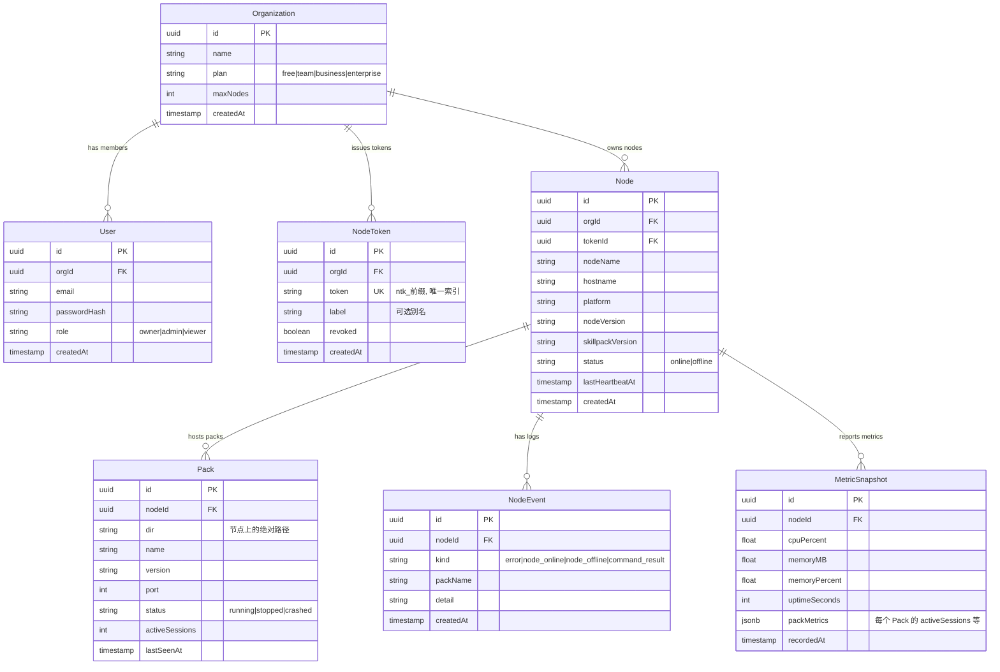
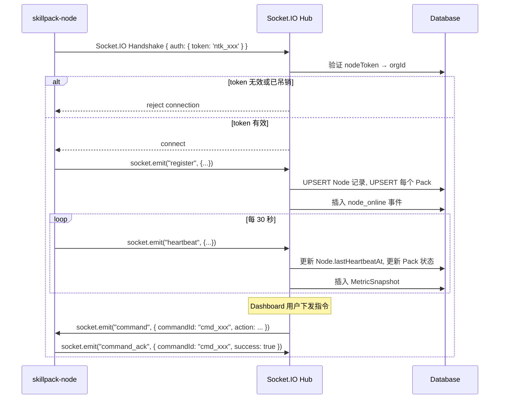
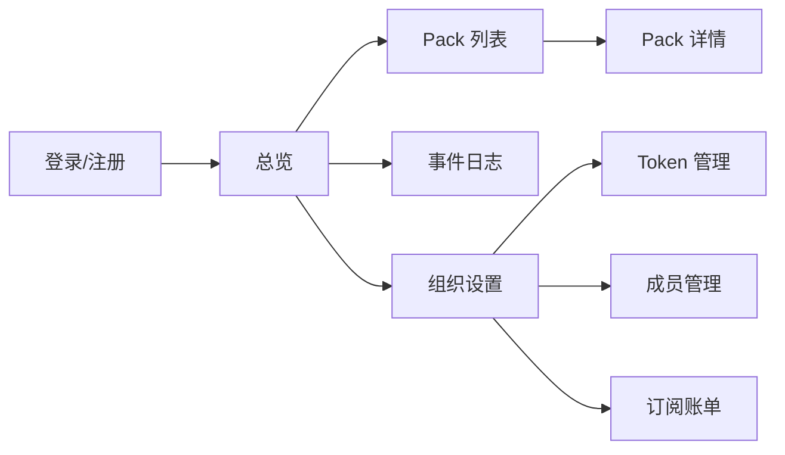
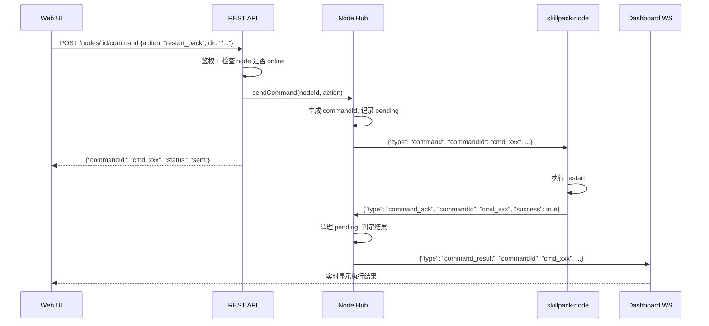
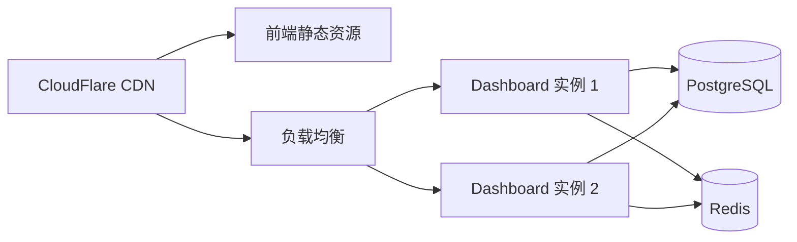

# Enterprise Dashboard — 服务端设计方案

> 本文档是 [enterprise_client_plan.md](./enterprise_client_plan.md) 的配套文档，定义 Dashboard 服务端的完整架构，涵盖技术选型、数据模型、API 设计、Web UI 规划和实施路线。

---

## 一、系统定位

Enterprise Dashboard 是 SkillPack 商业生态的**中心管理平面**：

```
┌──────────────────────────────────────────────────────────┐
│                  Enterprise Dashboard                     │
│                                                          │
│  ┌─────────┐  ┌──────────┐  ┌─────────┐  ┌───────────┐ │
│  │ Web UI  │  │ REST API │  │ WS Hub  │  │ Job Queue │ │
│  └────┬────┘  └────┬─────┘  └────┬────┘  └─────┬─────┘ │
│       └────────────┴─────────────┴──────────────┘       │
│                         │                                │
│                   ┌─────┴─────┐                         │
│                   │ Database  │                         │
│                   └───────────┘                         │
└──────────────────────────────────────────────────────────┘
         ▲                              ▲
         │ HTTPS                        │ WSS
    企业用户浏览器                 skillpack-node × N
```

**核心职责：**

1. 接受 `skillpack-node` 的 WS 连接，接收上行状态与指令回执，下发控制指令
2. 为企业用户提供 Web UI，展示节点和 Pack 的实时状态
3. 管理多租户（Organization）、用户认证、权限控制
4. 存储历史指标、节点在线状态与指令结果日志

---

## 二、技术选型

| 类别          | 技术                            | 理由                                       |
| ------------- | ------------------------------- | ------------------------------------------ |
| **运行时**    | Node.js (≥20)                   | 与 SkillPack 生态保持统一                  |
| **Web 框架**  | Fastify                         | 高性能、插件体系完善、原生 TypeScript 支持 |
| **WebSocket** | `socket.io` (via `fastify-socket.io`) | 稳定性高，自带断线重连、事件驱动、房间分组等功能 |
| **数据库**    | PostgreSQL                      | JSONB 支持、成熟可靠、生态丰富             |
| **ORM**       | Drizzle ORM                     | 类型安全、零抽象开销、SQL-first            |
| **认证**      | JWT (access + refresh token)    | 无状态、易于横向扩展                       |
| **前端框架**  | React + Vite                    | 快速开发，组件生态丰富                     |
| **部署**      | Docker → Fly.io / Railway       | 一键部署、全球边缘节点                     |
| **队列**      | BullMQ (Redis)                  | 延时任务（超时检测/告警）                  |

---

## 三、数据模型

### ER 图



### Pack 唯一标识

> 参见 [enterprise_client_plan.md](./enterprise_client_plan.md) — _Pack 唯一标识策略_

Dashboard 使用 **`nodeId + dir`** 的复合唯一索引标识 Pack：

```sql
CREATE UNIQUE INDEX idx_pack_node_dir ON pack(node_id, dir);
```

- `nodeId` 由 `nodeToken` 关联确定（一个 token 对应一个 Node）
- `dir` 是 Pack 在节点机器上的绝对路径
- 同一 token 下同一 `dir` 做 **upsert**，不会重复创建

---

## 四、API 设计

### 4.1 WebSocket 端点 — 节点通信

#### 端点

```
wss://dashboard.cremini.ai/  (namespace 默认为 /, 连接时通过 auth 选项传递 token)
```

#### 连接生命周期



#### 消息处理规则

| 上行事件类型  | Dashboard 处理                                                           |
| ------------- | ------------------------------------------------------------------------ |
| `register`    | UPSERT `Node` + 批量 UPSERT `Pack`，标记 `status: online`                |
| `heartbeat`   | 更新 `Node.lastHeartbeatAt`，更新每个 `Pack` 状态，写入 `MetricSnapshot` |
| `command_ack` | 匹配 `commandId`，更新指令执行结果，通知前端                             |

#### 在线检测

- 启动定时任务（BullMQ repeatable job），每 60 秒扫描 `lastHeartbeatAt`
- 若 `now - lastHeartbeatAt > 3 × heartbeatInterval`，标记 `Node.status = offline`
- 插入 `node_offline` 事件

### 4.2 REST API — 前端通信

#### 认证

```
POST   /api/auth/login          # 登录 → 返回 JWT
POST   /api/auth/register       # 注册（创建 Organization + 首个 Owner）
POST   /api/auth/refresh        # 刷新 token
```

#### 组织管理

```
GET    /api/org                  # 获取当前组织信息
PUT    /api/org                  # 更新组织名称
GET    /api/org/members          # 列出成员
POST   /api/org/members/invite   # 邀请成员
DELETE /api/org/members/:userId  # 移除成员
```

#### Node Token 管理

```
GET    /api/tokens               # 列出所有 token
POST   /api/tokens               # 生成新 token（返回明文，仅此一次）
DELETE /api/tokens/:tokenId      # 吊销 token
```

#### Pack（主要视图数据源）

```
GET    /api/packs                # 列出所有 Pack（跨节点，含节点名称）
GET    /api/packs/:packId        # Pack 详情（含所属节点信息）
GET    /api/packs/:packId/events # Pack 相关事件日志（分页）
```

#### 节点（辅助查询）

```
GET    /api/nodes                # 列出所有节点
GET    /api/nodes/:nodeId        # 节点详情
GET    /api/nodes/:nodeId/metrics # 节点历史指标（时间范围查询）
GET    /api/nodes/:nodeId/events # 节点事件日志（分页）
```

#### 远程控制

```
POST   /api/packs/:packId/command
Body: {
  "action": "start" | "stop" | "restart"
}
Response: {
  "commandId": "cmd_abc123",
  "status": "sent"                     // 异步，通过 WS 推送结果
}

POST   /api/nodes/:nodeId/deploy
Body: {
  "zipUrl": "https://...",
  "targetDir": "/path/to/target"
}
Response: {
  "commandId": "cmd_abc123",
  "status": "sent"
}
```

### 4.3 WebSocket 端点 — 前端实时推送

```
wss://dashboard.cremini.ai/ (前台 namespace, via Socket.IO, 使用 auth token 进行握手鉴权)
```

前端建立 Socket.IO 连接后，监听相应的事件以实时接收数据：

```typescript
// 节点状态变更
socket.on("node_status", (payload: { nodeId: "...", status: "online" | "offline" }) => { ... });

// Pack 状态变更 (通过后台状态轮询探活得出实时状态)
socket.on("pack_status", (payload: { nodeId: "...", dir: "...", status: "running" | "stopped" }) => { ... });

// 指令回执
socket.on("command_result", (payload: { commandId: "...", success: boolean, message: "..." }) => { ... });
```

---

## 五、权限模型

### 角色定义

| 角色       | 查看节点/Pack | 远程控制 | 管理 Token | 管理成员 | 账单 |
| ---------- | :-----------: | :------: | :--------: | :------: | :--: |
| **viewer** |      ✅       |    ❌    |     ❌     |    ❌    |  ❌  |
| **admin**  |      ✅       |    ✅    |     ✅     |    ❌    |  ❌  |
| **owner**  |      ✅       |    ✅    |     ✅     |    ✅    |  ✅  |

### Plan 限制

| Plan           | 最大节点数 | 历史数据保留 |    告警通知     |
| -------------- | :--------: | :----------: | :-------------: |
| **Team**       |     10     |     7 天     |      Email      |
| **Business**   |     50     |    30 天     | Email + Webhook |
| **Enterprise** |    无限    |    自定义    |     全渠道      |

---

## 六、Web UI 页面规划

### 设计理念

> [!IMPORTANT]
> Web UI **以 Pack 为核心视角**，用户关心的是「我的哪些 Agent 在运行」，而非「哪台机器在线」。节点信息作为 Pack 的附属属性展示（如标签/副标题），不单独成为主导航入口。

### 页面清单



### 关键页面设计

#### 1. 总览 Dashboard `/`

```
┌──────────────────────────────────────────────────────────┐
│  📦 8 Pack 运行中   ⏸️ 3 已停止   ⚠️ 1 已崩溃           │
│  🟢 3 节点在线   🔴 1 离线                              │
├──────────────────────────────────────────────────────────┤
│                                                          │
│  名称              状态     节点             操作        │
│  ────────────────────────────────────────────────────    │
│  Comic Explainer   🟢 运行  办公室-Mac-1     ⏹️ 🔄      │
│  Code Reviewer     🟢 运行  办公室-Mac-1     ⏹️ 🔄      │
│  Translator        🟢 运行  办公室-Mac-1     ⏹️ 🔄      │
│  Data Analyzer     🟢 运行  服务器-Linux     ⏹️ 🔄      │
│  Email Helper      🟢 运行  服务器-Linux     ⏹️ 🔄      │
│  Report Gen        🔴 停止  测试机 🔴        ▶️         │
│  Chat Bot          🔴 停止  测试机 🔴        ▶️         │
│  Image Gen         ⚠️ 崩溃  测试机 🔴        🔄         │
│                                                          │
│  ─ 可按 状态 / 节点 筛选排序 ─                           │
│                                                          │
│  📋 最近日志                                              │
│  ────────────────────────────────────────────────────    │
│  10:30  ✅  restart 指令执行成功           (测试机)      │
│  10:28  ✅  stop 指令执行成功              (服务器-Linux)│
│  10:15  🔴  测试机 went offline                          │
└──────────────────────────────────────────────────────────┘
```

#### 2. Pack 详情 `/packs/:id`

```
┌──────────────────────────────────────────────────────────┐
│  ← Pack 列表                                             │
│                                                          │
│  📦 Comic Explainer                          🟢 运行中   │
│  v1.0.0                                                  │
├──────────────────────────────────────────────────────────┤
│  所属节点   办公室-Mac-1 🟢                               │
│  目录      /Users/me/packs/comic-explainer               │
│  端口      26313                                         │
│  活跃会话   2                                             │
│  最后更新   30 秒前                                       │
├──────────────────────────────────────────────────────────┤
│  操作：  [⏹️ 停止]  [🔄 重启]                             │
├──────────────────────────────────────────────────────────┤
│                                                          │
│  [状态同步]  [节点指标]                                   │
│  ────────────────────────────────────────────────────    │
│  10:30  状态同步：running                                │
│  10:28  状态同步：stopped                                │
│  10:25  状态同步：running                                │
│  09:00  状态同步：running                                │
└──────────────────────────────────────────────────────────┘
```

#### 3. Token 管理 `/settings/tokens`

```
┌──────────────────────────────────────────────────────────┐
│  组织设置 > Token 管理                                    │
│                                                          │
│  [+ 生成新 Token]                                        │
│                                                          │
│  Label        Token            节点         状态  操作   │
│  ────────────────────────────────────────────────────    │
│  办公室 Mac   ntk_a1b...d4     办公室-Mac-1  ✅    [吊销]│
│  生产服务器   ntk_x7z...89     服务器-Linux  ✅    [吊销]│
│  旧测试机     ntk_old...xx     —             ❌ 已吊销   │
│                                                          │
│  ⚠️ Token 生成后仅显示一次，请妥善保存                    │
└──────────────────────────────────────────────────────────┘
```

---

## 七、项目结构

```
skillpack-dashboard/
├── package.json
├── tsconfig.json
├── docker-compose.yml              # PostgreSQL + Redis 本地开发
├── Dockerfile
├── drizzle.config.ts
├── src/
│   ├── index.ts                    # Fastify 入口
│   ├── config.ts                   # 环境变量配置
│   ├── db/
│   │   ├── schema.ts               # Drizzle 表定义
│   │   ├── migrate.ts              # 迁移脚本入口
│   │   └── migrations/             # SQL 迁移文件
│   ├── auth/
│   │   ├── jwt.ts                  # JWT 签发/验证
│   │   ├── password.ts             # 密码哈希（bcrypt）
│   │   └── guard.ts                # 角色鉴权中间件
│   ├── routes/
│   │   ├── auth.ts                 # /api/auth/*
│   │   ├── org.ts                  # /api/org/*
│   │   ├── tokens.ts               # /api/tokens/*
│   │   ├── packs.ts                # /api/packs/*（主要视图）
│   │   ├── nodes.ts                # /api/nodes/*（辅助查询）
│   │   └── commands.ts             # /api/packs/:id/command + /api/nodes/:id/deploy
│   ├── ws/
│   │   ├── node-hub.ts             # 节点 WS 连接管理（核心）
│   │   ├── dashboard-hub.ts        # 前端 WS 推送
│   │   └── types.ts                # WS 消息类型（与 client 对齐）
│   ├── services/
│   │   ├── node-service.ts         # 节点业务逻辑
│   │   ├── pack-service.ts         # Pack 业务逻辑
│   │   ├── token-service.ts        # Token 生成/验证
│   │   └── health-checker.ts       # 节点在线检测定时任务
│   └── utils/
│       ├── id.ts                   # UUID / Token 生成
│       └── logger.ts               # 日志
├── web/                            # React 前端（Vite）
│   ├── index.html
│   ├── src/
│   │   ├── main.tsx
│   │   ├── App.tsx
│   │   ├── api/                    # API 客户端
│   │   ├── hooks/                  # WebSocket hooks
│   │   ├── pages/
│   │   │   ├── Login.tsx
│   │   │   ├── Dashboard.tsx       # 总览（Pack 列表为核心）
│   │   │   ├── PackDetail.tsx      # Pack 详情（含节点标签）
│   │   │   ├── Events.tsx
│   │   │   └── Settings/
│   │   │       ├── Tokens.tsx
│   │   │       ├── Members.tsx
│   │   │       └── Billing.tsx
│   │   └── components/
│   │       ├── PackCard.tsx         # Pack 卡片（显示节点标签）
│   │       ├── PackTable.tsx        # Pack 列表表格
│   │       ├── NodeBadge.tsx        # 节点名称标签（小组件）
│   │       ├── MetricsChart.tsx
│   │       ├── EventTimeline.tsx
│   │       └── StatusBadge.tsx
│   └── package.json
└── tests/
    ├── ws/
    │   └── node-hub.test.ts
    ├── routes/
    │   ├── auth.test.ts
    │   └── nodes.test.ts
    └── services/
        └── health-checker.test.ts
```

---

## 八、核心模块设计

### 8.1 Node Hub（节点 WS 管理器）

这是 Dashboard 最核心的模块，管理所有 `skillpack-node` 的 WS 长连接。

```typescript
// 伪代码：核心数据结构
class NodeHub {
  // nodeToken → WebSocket 映射
  private connections: Map<string, WebSocket>;

  // 处理新连接
  async handleConnection(ws: WebSocket, token: string): Promise<void>;

  // 处理上行消息
  async handleMessage(token: string, msg: UpstreamMessage): Promise<void>;

  // 下发指令
  async sendCommand(nodeId: string, action: CommandAction): Promise<string>;

  // 断线处理
  async handleDisconnect(token: string): Promise<void>;
}
```

**关键设计点：**

| 问题                | 方案                                     |
| ------------------- | ---------------------------------------- |
| 同一 token 重复连接 | 踢掉旧连接，保留新连接                   |
| 指令超时            | 30 秒未收到 ack 则标记失败               |
| 并发写入            | heartbeat 触发的 DB 写入使用批量 upsert  |
| 内存管理            | `connections` Map 中的 WS 断开后及时清理 |

### 8.2 Health Checker（在线检测）

```typescript
// BullMQ repeatable job，每 60 秒执行一次
async function checkNodeHealth() {
  const threshold = Date.now() - 3 * HEARTBEAT_INTERVAL;

  // 将超时节点标记为 offline
  const offlineNodes = await db
    .update(nodes)
    .set({ status: "offline" })
    .where(
      and(
        eq(nodes.status, "online"),
        lt(nodes.lastHeartbeatAt, new Date(threshold)),
      ),
    )
    .returning();

  // 为每个新离线节点插入事件
  for (const node of offlineNodes) {
    await insertEvent(node.id, "node_offline");
    dashboardHub.broadcast({
      type: "node_status",
      nodeId: node.id,
      status: "offline",
    });
  }
}
```

### 8.3 指令流工作流



---

## 九、安全设计

| 维度           | 措施                                            |
| -------------- | ----------------------------------------------- |
| **传输加密**   | 全站 HTTPS/WSS                                  |
| **节点认证**   | nodeToken 验证，支持吊销                        |
| **用户认证**   | JWT + HttpOnly Refresh Cookie                   |
| **密码存储**   | bcrypt (cost factor 12)                         |
| **Token 存储** | 数据库仅存 SHA-256 哈希，明文仅在创建时返回一次 |
| **RBAC**       | 角色守卫中间件，API 级别防护                    |
| **速率限制**   | 登录接口限频（5次/分钟），API 全局限频          |
| **CORS**       | 仅允许 Dashboard 前端域名                       |
| **输入校验**   | Fastify JSON Schema 校验全部输入                |

---

## 十、部署方案

### 生产环境



### 横向扩展注意事项

| 问题           | 方案                                                                |
| -------------- | ------------------------------------------------------------------- |
| WS 连接粘性    | 同一 nodeToken 的连接固定到一个实例（IP Hash / Consistent Hashing） |
| 跨实例指令下发 | 通过 Redis Pub/Sub 广播到持有目标 WS 连接的实例                     |
| 前端 WS 推送   | 事件通过 Redis Pub/Sub 扇出到所有实例                               |

### 本地开发

```bash
# 启动依赖
docker compose up -d   # PostgreSQL + Redis

# 启动服务端
npm run dev            # Fastify 热重载

# 启动前端
cd web && npm run dev  # Vite 热重载
```

---

## 十一、代码量估算

| 模块                           | 行数      |
| ------------------------------ | --------- |
| 数据库层（Schema + Migration） | ~300      |
| 认证模块                       | ~200      |
| REST API 路由                  | ~400      |
| WebSocket Hub（节点 + 前端）   | ~500      |
| 业务 Service 层                | ~300      |
| 工具 + 配置                    | ~100      |
| **后端合计**                   | **~1800** |
| React 前端页面                 | ~1500     |
| 前端组件 + Hooks               | ~600      |
| **前端合计**                   | **~2100** |
| **总计**                       | **~3900** |

---

## 十二、实施路线

### Phase 1：基础骨架

> **目标**：服务端能接受节点 WS 连接、存储状态、提供基本 API

- [ ] 项目初始化（Fastify + Drizzle + Docker Compose）
- [ ] 数据库 Schema 建表（Organization, User, NodeToken, Node, Pack）
- [ ] 用户注册/登录 API + JWT
- [ ] NodeToken 生成/验证/吊销 API
- [ ] WS 节点连接端点：token 验证 + register 处理
- [ ] WS heartbeat 处理 + Node/Pack 状态更新

### Phase 2：远程控制 + 日志系统

> **目标**：能下发指令并追踪结果，记录状态与控制日志

- [ ] 指令下发 API + WS 转发 + ack 处理
- [ ] 状态/控制日志记录 + REST 查询 API
- [ ] 在线检测定时任务（Health Checker）
- [ ] MetricSnapshot 存储 + 查询 API

### Phase 3：Web UI

> **目标**：企业用户能通过浏览器使用所有功能（以 Pack 为核心视角）

- [ ] 登录/注册页
- [ ] Dashboard 总览页（Pack 列表 + 节点标签 + 状态筛选 + 实时状态）
- [ ] Pack 详情页（状态/操作/状态同步记录/节点信息）
- [ ] 日志页（时间线 + 按 Pack/节点筛选）
- [ ] 设置页（Token 管理 + 成员管理）
- [ ] 前端 WS 实时推送集成

### Phase 4：商业化 + 运营

> **目标**：准备商业化上线

- [ ] Plan 限制中间件（节点数上限）
- [ ] 历史数据清理定时任务
- [ ] 订阅 + 支付集成（Stripe）
- [ ] 生产环境部署 + 监控
- [ ] 文档门户（接入指南、API 参考）
